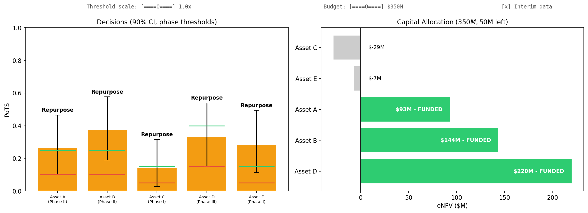
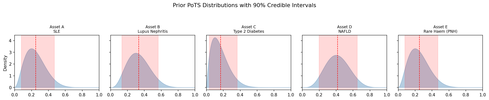
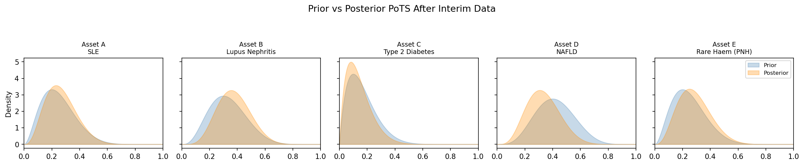
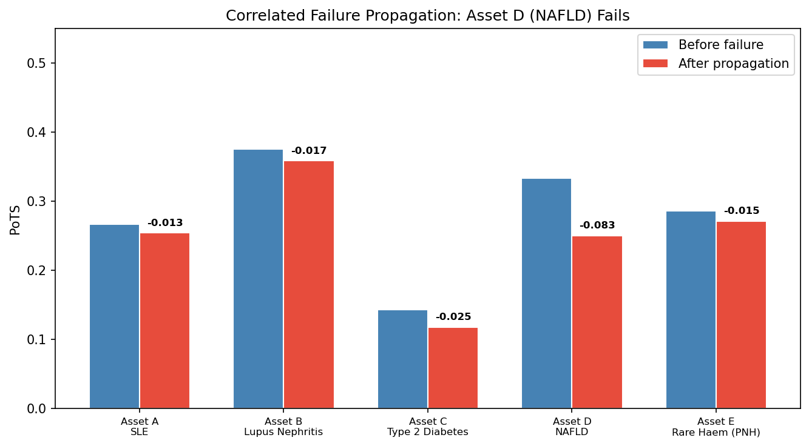
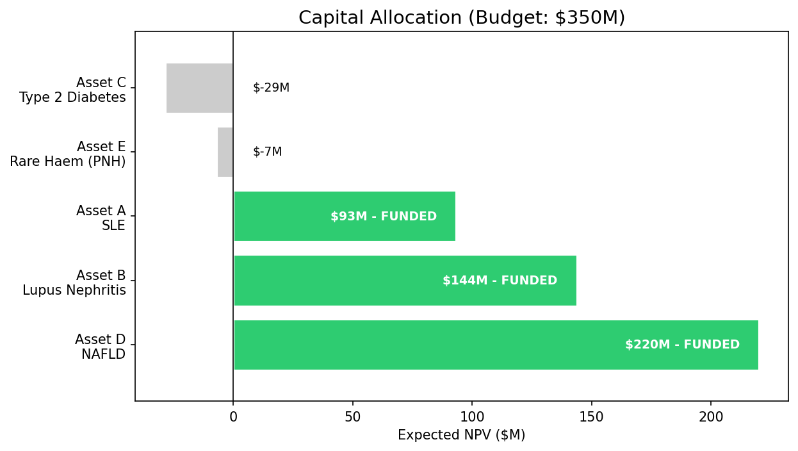
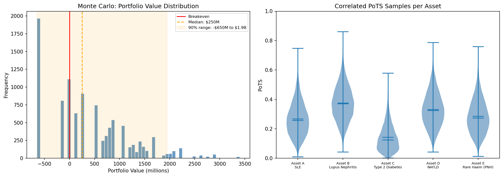
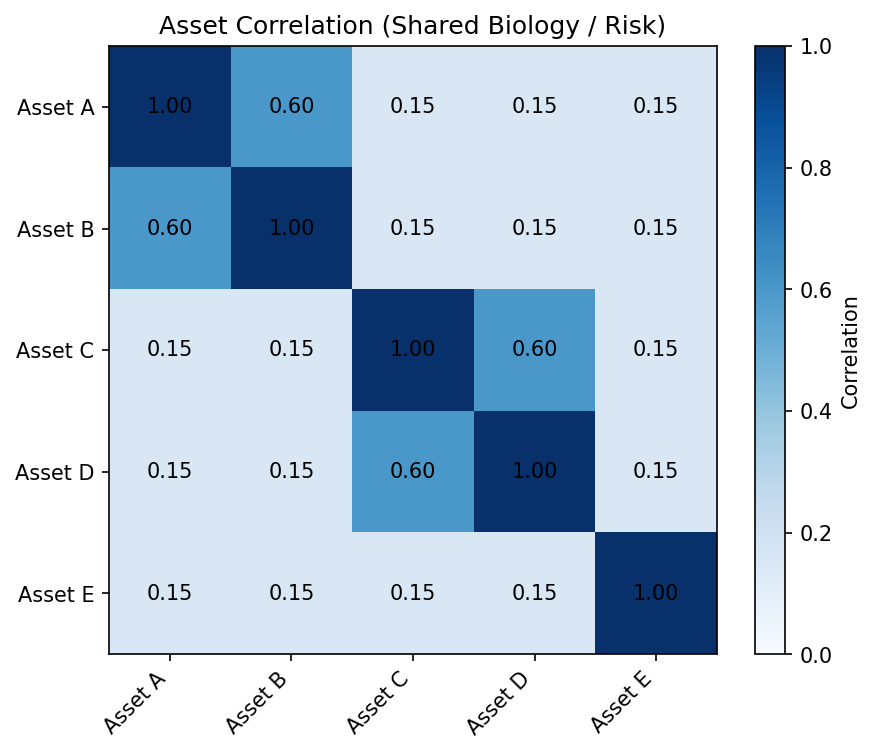
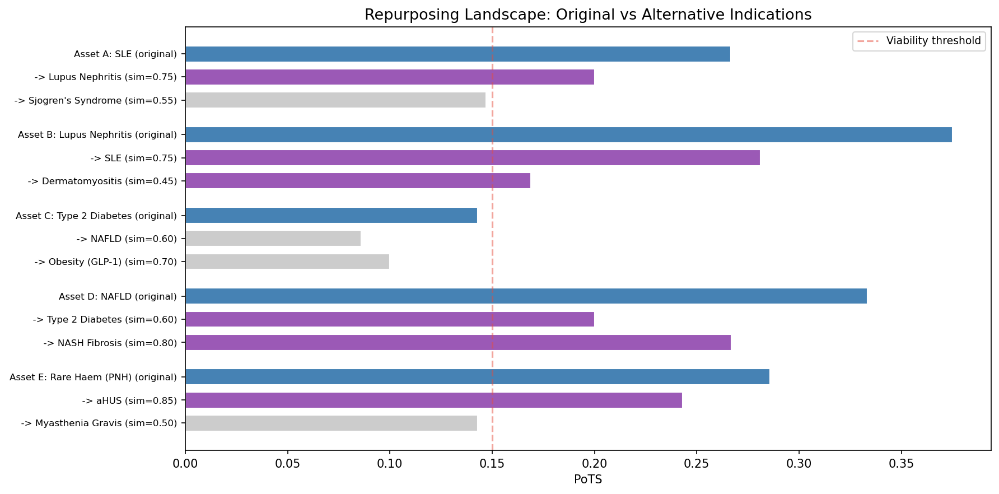

# Biotech Portfolio PoTS Decision Engine

A Bayesian, portfolio-level decision engine that dynamically updates the probability of therapeutic success (PoTS) and improves go/kill/repurpose decisions in biotech development.

All data is simulated. This is a toy model to illustrate how adaptive Bayesian updates can guide capital allocation decisions across a small portfolio of biotech programs. Motivated by UK rare disease programs, where high-quality longitudinal data allows early signals to update PoTS across correlated assets.

## Interactive Decision Explorer

The notebook includes live sliders for threshold scaling, budget, and interim data toggling. Decisions and capital allocation update in real time.



*Run `jupyter notebook portfolio_demo.ipynb` for the full interactive version.*

## Features

- CSV-driven portfolio definition (swap in any set of assets)
- Dynamic PoTS updating via Beta-Binomial Bayesian model
- Credible interval-based decisions (not just point estimates)
- Phase-dependent thresholds (the bar rises with capital commitment)
- Correlated failure propagation across the portfolio
- Biology-driven repurposing with Bayesian PoTS transfer
- Expected value and capital allocation under a fixed budget
- Monte Carlo simulation with correlated sampling (Gaussian copula)
- Interactive controls for threshold tuning and scenario exploration

## Prior PoTS Distributions

Each asset starts with a Beta-distributed prior reflecting historical success/failure data. Red shading shows the 90% credible interval.



## Bayesian Updating After Interim Data

As interim trial results come in, posteriors shift. Assets with positive signals move right, negative signals move left.



## Portfolio Decision Dashboard

Decisions based on 90% credible intervals with phase-dependent thresholds. Phase III assets face a higher bar than Phase I - more capital at risk means stricter criteria. Red/green lines show per-asset kill/go thresholds.


## Correlated Failure Propagation

When Asset D (NAFLD, Phase III) fails a pivotal readout, correlated assets absorb virtual failures weighted by the correlation matrix. Asset C (same metabolic group, correlation 0.6) takes the biggest hit.



## Capital Allocation

Risk-adjusted expected NPV drives a greedy allocation under a fixed budget. Only positive-eNPV assets get funded, highest first.



## Monte Carlo Portfolio Simulation

10,000 simulations using a Gaussian copula to respect correlations between assets. Shows the full distribution of portfolio outcomes, not just point estimates.



## Asset Correlation (Shared Biology / Risk)

Assets sharing biological mechanisms or therapeutic areas are correlated. This matrix drives both failure propagation and the Monte Carlo copula.



## Repurposing Landscape

When an asset is flagged for repurposing, the engine identifies alternative indications based on biological similarity. Repurpose PoTS is computed as original PoTS scaled by a similarity score - not an arbitrary bucket.



## Getting Started

```bash
pip install numpy pandas matplotlib scipy ipywidgets
jupyter notebook portfolio_demo.ipynb
```

## Data Files

- `data/assets.csv` - Portfolio definition: assets, phases, priors, revenue/cost estimates, correlation groups
- `data/repurpose_map.csv` - Repurpose candidates with similarity scores and biological rationale
