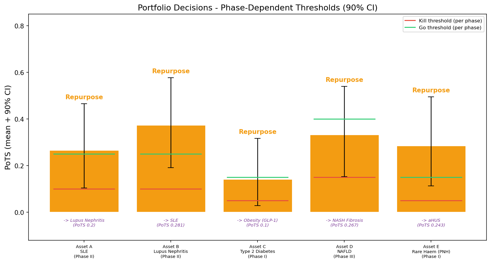

# Biotech Portfolio Decision Engine

A Bayesian engine for go/kill/repurpose decisions across a small biopharma portfolio. Built to explore how adaptive probability-of-technical-success (PoTS) models can sharpen capital allocation decisions in early-stage drug development.

**View the notebook**: [portfolio_demo.ipynb](https://github.com/ChristopherSNelson/PoTS_decisionTool/blob/main/portfolio_demo.ipynb)

---

## What it does

Each asset in the portfolio has a Beta-distributed prior over PoTS, updated as interim trial data comes in. The engine then makes phase-dependent decisions:

- **Go** - posterior mean exceeds the phase threshold; advance and commit capital
- **Continue** - uncertainty zone; gather more data before deciding
- **Kill** - posterior mean falls below kill threshold; stop and reallocate
- **Repurpose** - biology suggests a better indication; pivot rather than kill

Phase III assets face a stricter bar than Phase I - more capital at risk means higher evidence requirements.



---

## Key features

- **Bayesian updating** - Beta-Binomial posteriors combine historical priors with interim readouts
- **Correlated failure propagation** - when one asset fails, correlated assets absorb virtual failures weighted by a shared-biology correlation matrix
- **Biology-driven repurposing** - repurpose PoTS transfers from original indication via a mechanistic similarity score, not an arbitrary fallback
- **eNPV capital allocation** - greedy allocation under a fixed budget, ranked by risk-adjusted expected value
- **Monte Carlo simulation** - 10,000 portfolio simulations via Gaussian copula to respect asset correlations

---

## Portfolio snapshot (simulated data)

| Asset | Phase | Indication | PoTS | Decision |
|-------|-------|------------|------|----------|
| A | II | SLE | 29.4% | Go |
| B | II | Lupus Nephritis | 23.5% | Continue |
| C | I | Type 2 Diabetes | 8.7% | Kill |
| D | III | NAFLD | 47.1% | Go |
| E | I | Rare Haem (PNH) | 26.7% | Go |

*All data is simulated. This is a methodological demonstration, not a clinical claim.*

---

## Run it

```bash
pip install numpy pandas matplotlib scipy ipywidgets
jupyter notebook portfolio_demo.ipynb
```
