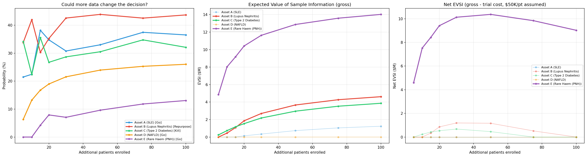
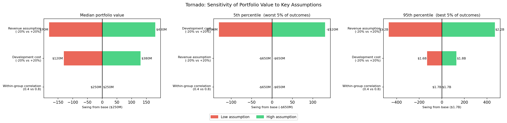

# Biotech Portfolio Decision Engine

A Bayesian engine for go/kill/repurpose decisions across a small biopharma portfolio. Built to explore how adaptive probability-of-technical-success (PoTS) models can sharpen capital allocation decisions in early-stage drug development.

**View the notebook**: [portfolio_demo.ipynb](https://github.com/ChristopherSNelson/PoTS_decisionTool/blob/main/portfolio_demo.ipynb)

---

## What it does

Each asset in the portfolio has a Beta-distributed prior over PoTS, updated as interim trial data comes in. The engine then makes phase-dependent decisions:

- **Go** - posterior mean exceeds the phase threshold; advance and commit capital
- **Continue** - uncertainty zone; gather more data before deciding
- **Kill** - posterior mean falls below kill threshold; stop and reallocate
- **Repurpose** - biology suggests a better indication; pivot rather than kill

Phase III assets face a stricter bar than Phase I - more capital at risk means higher evidence requirements.


---

## Key features

- **Bayesian updating** - Beta-Binomial posteriors combine historical priors with interim readouts
- **Correlated failure propagation** - when one asset fails, correlated assets absorb virtual failures weighted by a shared-biology correlation matrix
- **Biology-driven repurposing** - Continue-zone assets pivot to an alternative indication if mechanistic similarity is strong (>= 0.65); repurpose PoTS = original PoTS * similarity score
- **eNPV capital allocation** - greedy allocation under a fixed budget, ranked by risk-adjusted expected value
- **Monte Carlo simulation** - 10,000 portfolio simulations via Gaussian copula to respect asset correlations
- **Value of Information analysis** - Beta-Binomial predictive distribution computes the dollar value of enrolling N more patients before committing capital, answering "do we know enough to decide?"
- **Scenario stress testing** - Tornado diagram + Bear/Base/Bull scenarios vary correlation, revenue, and cost assumptions to show which levers most move portfolio value

---

## Portfolio snapshot (simulated data)

| Asset | Phase | Indication | PoTS | Decision |
|-------|-------|------------|------|----------|
| A | II | SLE | 29.4% | Go |
| B | II | Lupus Nephritis | 23.5% | Repurpose (SLE) |
| C | I | Type 2 Diabetes | 8.7% | Kill |
| D | III | NAFLD | 47.1% | Go |
| E | I | Rare Haem (PNH) | 26.7% | Go |

*All data is simulated. This is a methodological demonstration, not a clinical claim.*

---

## Value of Information - "Do we know enough to decide?"

For each asset, the engine simulates every possible outcome of enrolling N additional patients (via the Beta-Binomial predictive distribution) and asks: would the new data change the decision? The Expected Value of Sample Information (EVSI) quantifies this in dollar terms.



Key insight: **Asset E (PNH, Phase I)** clears the Go threshold on PoTS alone, but has the highest EVSI at $14M - because the data is thin (1/3 responders) and the cost is $150M. A small chance of discovering it should be killed is worth a lot of money. Meanwhile **Asset D (NAFLD, Phase III)** is a confident Go with near-zero EVSI - the data already speaks clearly.

This is the question portfolio managers actually lose sleep over: *"Is it worth running 20 more patients, or do we already know enough?"*

---

## Scenario stress test - "What could break this portfolio?"

Three tornado panels show the same assumptions at the median, worst 5%, and best 5% of outcomes - revealing that different levers dominate depending on where you look in the distribution.



- **Median** - revenue dominates ($70M to $430M swing). Correlation barely registers.
- **5th percentile (worst 5%)** - cost matters most in bad scenarios; correlation is still flat because in catastrophic runs all bets are wrong regardless of structure.
- **95th percentile (best 5%)** - revenue dominates even more strongly ($1.2B to $2.2B). The upside is almost entirely a function of market sizing assumptions.

| Scenario | Median | P(positive) | 5th pct | 95th pct |
|----------|--------|-------------|---------|---------|
| Bear (corr=0.8, rev-20%, cost+20%) | -$60M | 43% | -$780M | $1.1B |
| Base | $250M | 68% | -$650M | $1.7B |
| Bull (corr=0.4, rev+20%, cost-20%) | $560M | 80% | -$520M | $2.3B |

Correlation barely moves the median but does widen the loss tail - it is a risk lever, not a return lever.

---

## Run it

```bash
pip install numpy pandas matplotlib scipy ipywidgets
jupyter notebook portfolio_demo.ipynb
```
